# Power Apps QuickChart Component Library

Please see the documentation site for details.

[Documentation](https://quickchart.pensplace.co.uk)

## 1. Bar Chart 
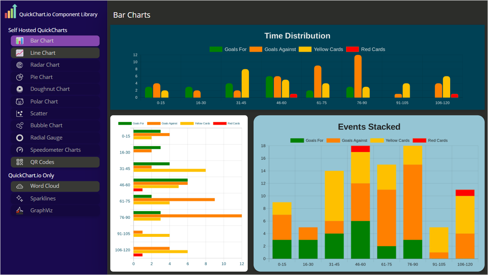
## 2. Line Chart 
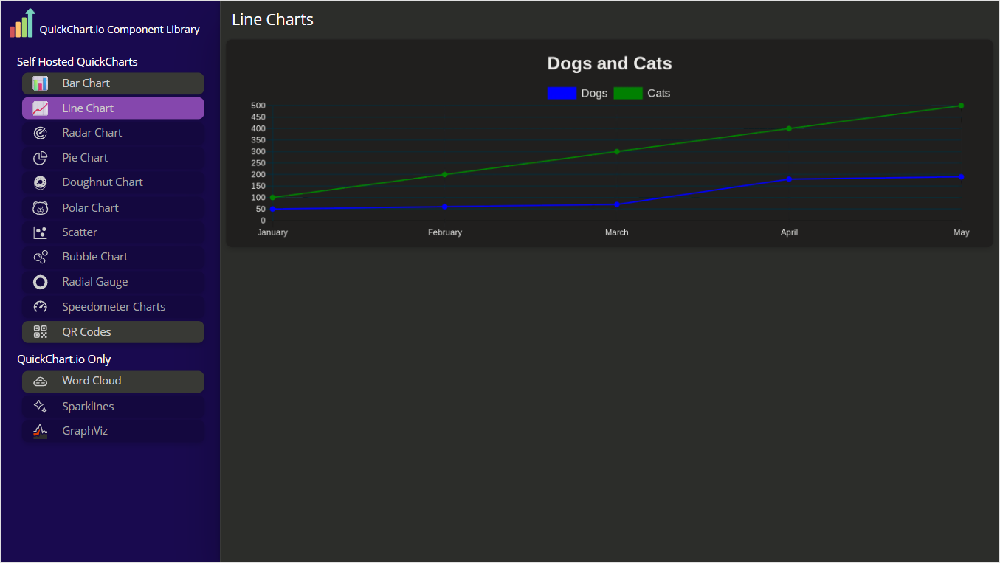
## 3. Radar Chart 
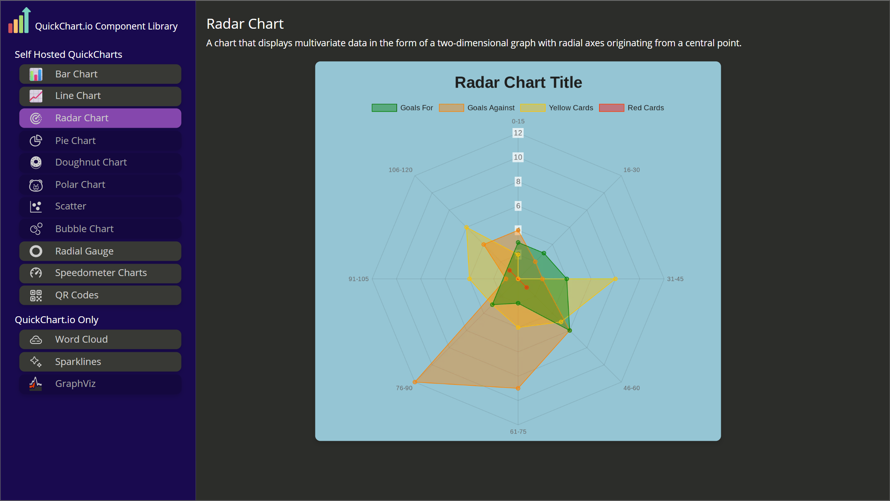
## 4. Pie / Doughnut Chart
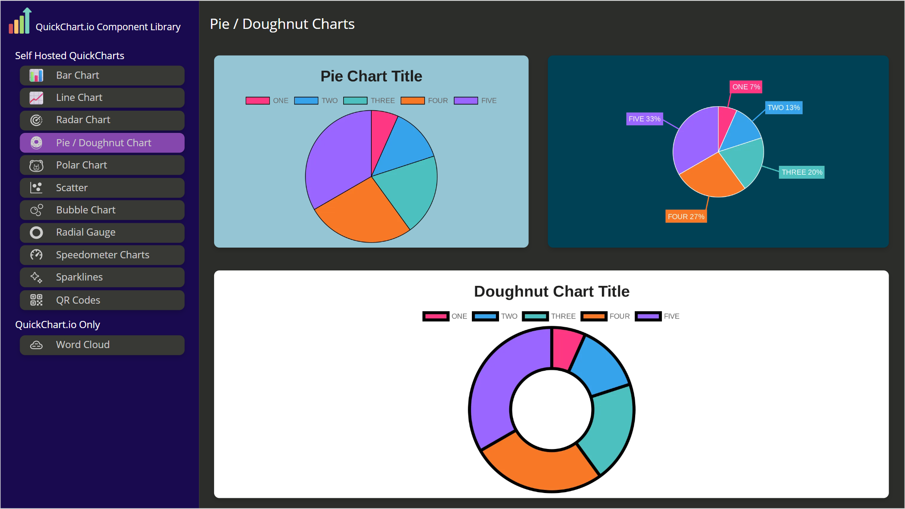
## 5. Polar Chart

## 6. Scatter Chart
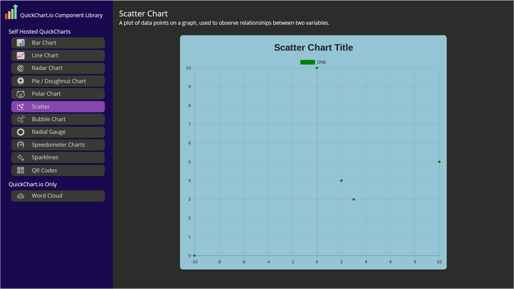
## 7. Bubble Chart
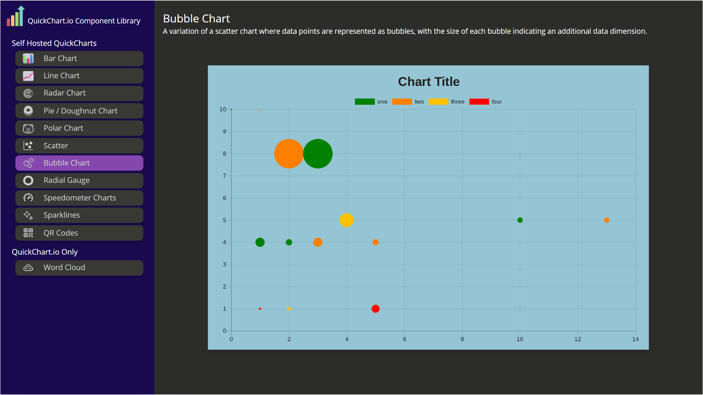
## 8. Radial Gauge 
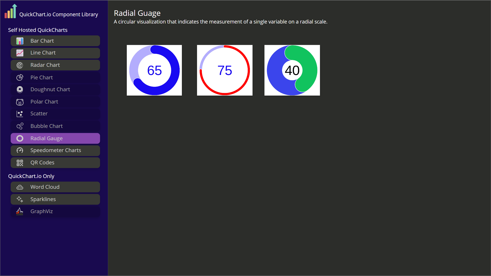
## 9. Speedometer Chart
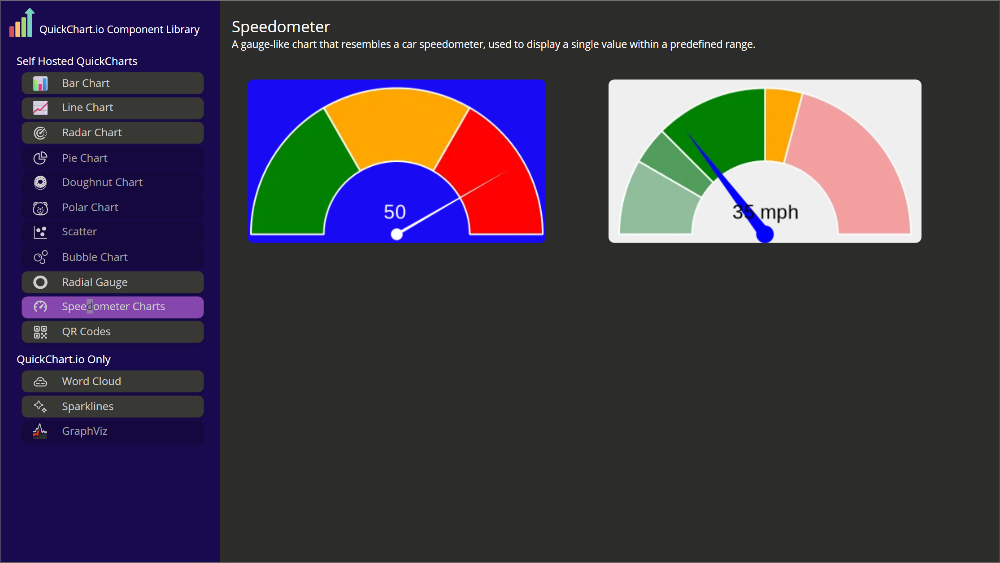 
## 10. QR Code 
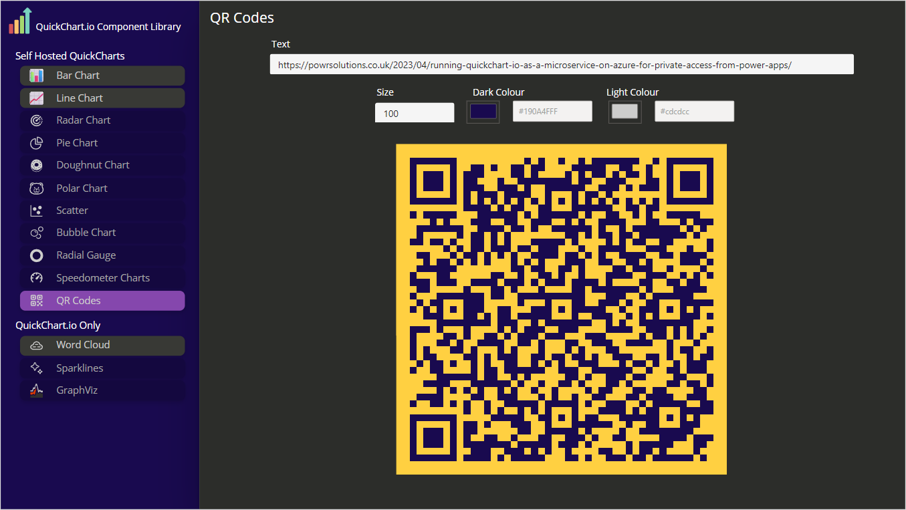
## 11. Word Cloud 
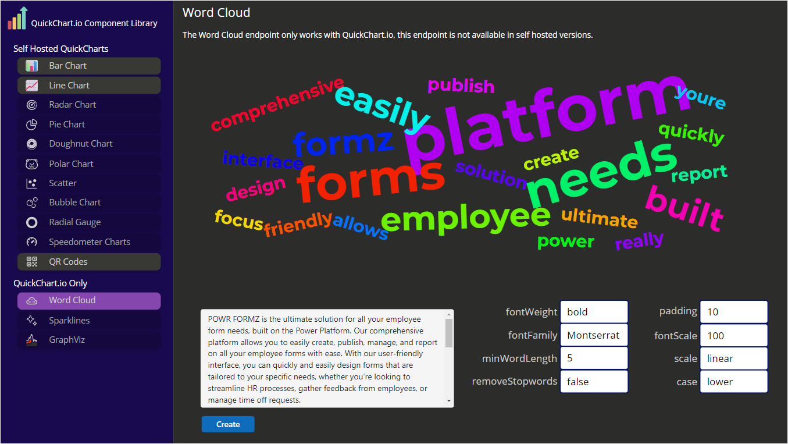
## 12. Sparkline 
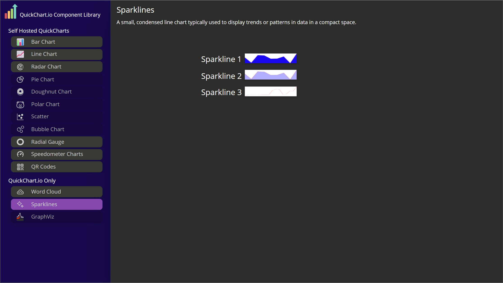